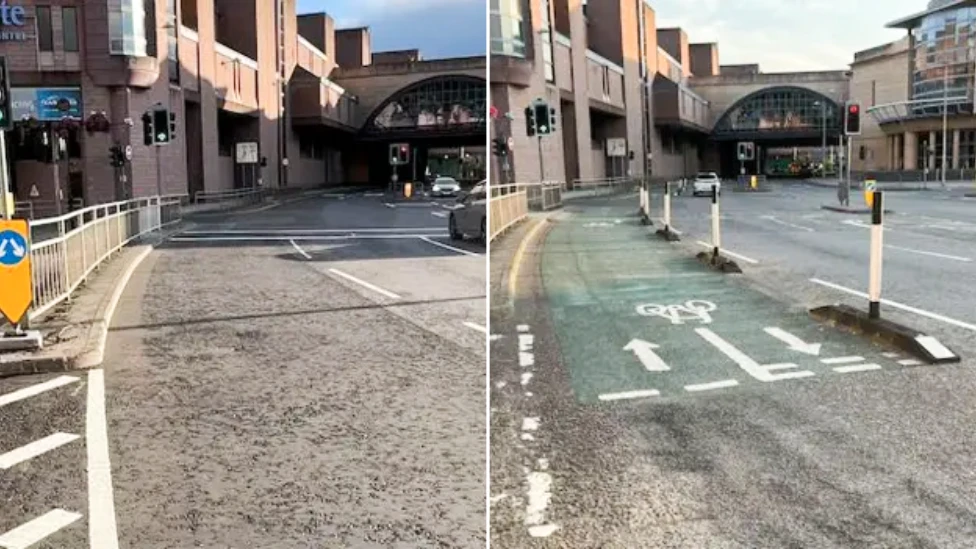

To open this project I'm going to have a look at some infrastructure that is close to home - the segregated bike lane on Millburn Road in Inverness.

During the height of the COVID-19 pandemic, cities across Scotland installed lots of temporary bike lanes as people's travel habits changes in response to the virus. One such lane was built along a stretch of Millburn Road[^1] protecting cyclists on a particularly busy route into the city. The road went from looking like this in 2017:

[^1]: It was shortened after a couple of years, more detail on that in a later post.

<iframe src="https://www.google.com/maps/embed?pb=!4v1788464524212!6m8!1m7!1sCDsIXwQnWN7DlLjHSoZ9kg!2m2!1d57.48009006687476!2d-4.218674253861359!3f217.12904765440703!4f-12.050525166695664!5f0.7820865974627469" width="600" height="450" style="border:0;" allowfullscreen loading="lazy" referrerpolicy="strict-origin-when-cross-origin">

</iframe>

To this in 2025:

<iframe src="https://www.google.com/maps/embed?pb=!4v1788464792219!6m8!1m7!1ss1U3zWeD_4YfZHfT9X6_NQ!2m2!1d57.48006149079656!2d-4.218620963175761!3f217.12904765440703!4f-12.050525166695664!5f0.7820865974627469" width="600" height="450" style="border:0;" allowfullscreen loading="lazy" referrerpolicy="strict-origin-when-cross-origin">

</iframe>

So you can see it's gone from a fairly inhospitable place to cycle, to one that's fairly attractive. Then in a surprising move earlier this year [Highland Council removed a section at the westernmost junction](https://www.bbc.co.uk/news/articles/cp9l34jn1e2o).

{#fig-lane-comparison fig-alt="A comparison image of the bike lane before and after the 2026 shortening"}

Over the next few weeks I'm going to explore some of the data around this junction to investigate how useful it's been to the city. I want to see what we can learn from the infrastructure to help better inform any plans for what comes next.
