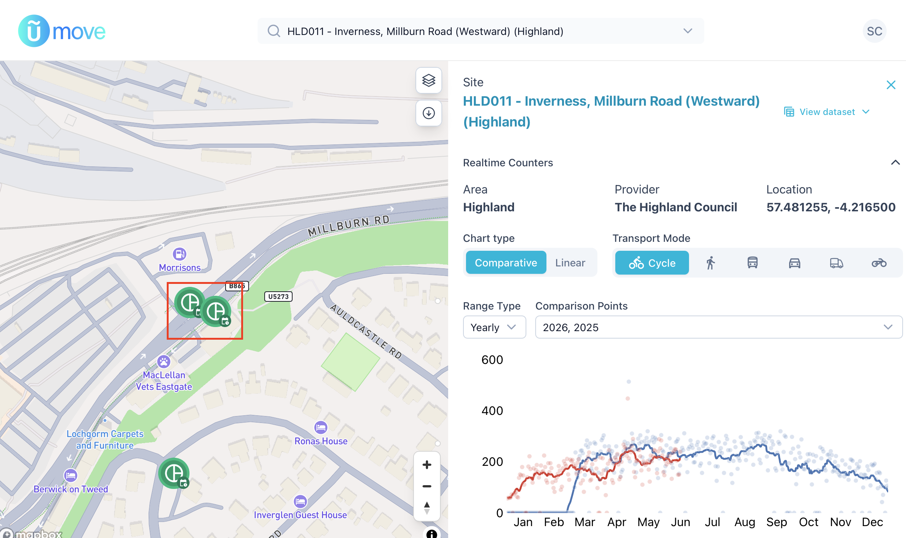
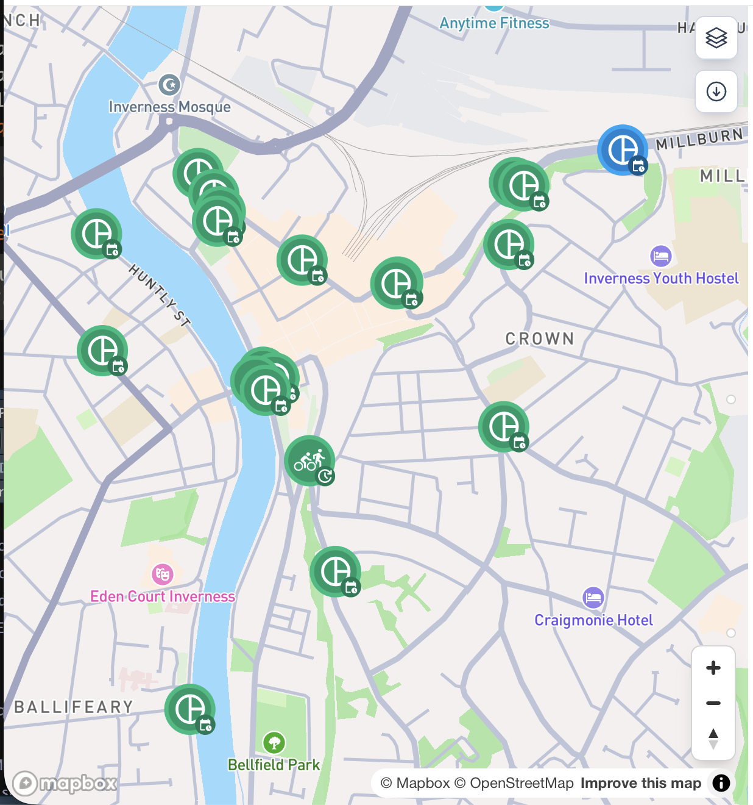

```{r}
#| label: setup
#| include: false

library(tidyverse)
library(plotly)
library(lubridate)
library(here)

# --- Load data -----------------------------------------------------------
# Paths are relative to the project root (themodeshift-scot/), found automatically
# by here() regardless of where this .qmd file lives in the project.
# Expects: themodeshift-scot/data/traffic_counts_inverness.csv
traffic_counts_inverness <- read_csv(here("data", "traffic_counts_inverness.csv"))

# shared plotly styling to match the site's light blue/white theme
plotly_theme <- function(p, y_title = NULL) {
  p %>%
    layout(
      paper_bgcolor = "rgba(0,0,0,0)",
      plot_bgcolor  = "rgba(0,0,0,0)",
      font  = list(color = "#1a1a1a", family = "Helvetica, Arial, sans-serif", size = 12),
      xaxis = list(gridcolor = "#e0e6ea", zeroline = FALSE, title = ""),
      yaxis = list(gridcolor = "#e0e6ea", zeroline = FALSE, title = y_title),
      legend = list(orientation = "h", y = -0.2),
      margin = list(l = 60, r = 20, t = 10, b = 40)
    ) %>%
    config(displaylogo = FALSE)
}

millburn_orange <- "#eb6834"
accent_blue     <- "#2a78d6"
accent_green    <- "#1baf7a"
muted_gray      <- "#6b7278"
```


To understand more about the bike lane on Millburn Road, I wanted to look at the cycling traffic levels right across the city of Inverness. The excellent news is that [Cycling Scotland have an Open Data portal](https://cycling-scotland-dashboard.usmart.io/) that tracks lots of places across Scotland. The less great news is that the data starts in 2021, so there's no simple before/after picture to see the effect of the installation of new bike lanes during the COVID-19 pandemic. There's still a lot to learn from what is there though!

Millburn Road has two traffic counters, one each for the Eastward and Westward sections of the road. The point where the counters appear on the map is almost exactly where the section of bike lane has been removed making it a good place to measure bike traffic:

{fig-alt="A map zoomed in on Millburn Road in Inverness on which two traffic counters are marked. The right of the image shows some of the stats from the counter."}

By grabbing the data from both the [Eastward](https://umove.usmart.ai/organisation/peopleandplace/dashboard/cycle-open-data?site=HLD002) and [Westward](https://umove.usmart.ai/organisation/peopleandplace/dashboard/cycle-open-data?site=HLD011) counters it's pretty easy to see which side of the road has a bike lane:

```{r}
#| label: fig-eastwest
#| fig-cap: "Average daily cycle counts on Millburn Road by direction, 2022–2026"
#| fig-alt: "Line chart comparing eastward and westward daily cycling volumes on Millburn Road over time"
#| echo: false # don't show the code

millburn_cycle_volume <- traffic_counts_inverness %>%
  filter(siteID %in% c("HLD002", "HLD011"), class == "cycle") %>%
  mutate(
    date = as.Date(startTime),
    direction = if_else(siteID == "HLD002", "Eastward", "Westward")
  ) %>%
  filter(date >= as.Date("2022-01-01")) %>%
  group_by(direction, date) %>%
  summarise(daily_cycle_count = sum(count), .groups = "drop") %>%
  group_by(direction, month = floor_date(date, "month")) %>%
  summarise(avg_daily_cycle_count = mean(daily_cycle_count, na.rm = TRUE), .groups = "drop")

p_eastwest <- plot_ly(
  millburn_cycle_volume, x = ~month, y = ~avg_daily_cycle_count, color = ~direction,
  colors = c("Eastward" = muted_gray, "Westward" = millburn_orange),
  type = "scatter", mode = "lines+markers",
  line = list(width = 2.5), marker = list(size = 5)
)

p_eastwest %>% plotly_theme(y_title = "Avg daily cycle count")
```
After a look to see if the data is what we want (it is) we can then download the full dataset for the Highland Council area. This gives daily aggregated counts at each site of cyclists, pedestrians, motorcycles, cars, buses, and goods vehicles from March 2021 to June 2026.

In the next post, we'll look at how the cycle counts compare to the other city centre sites:

{fig-alt="A map zoomed in on Inverness city centre on which several traffic counters are marked. "}