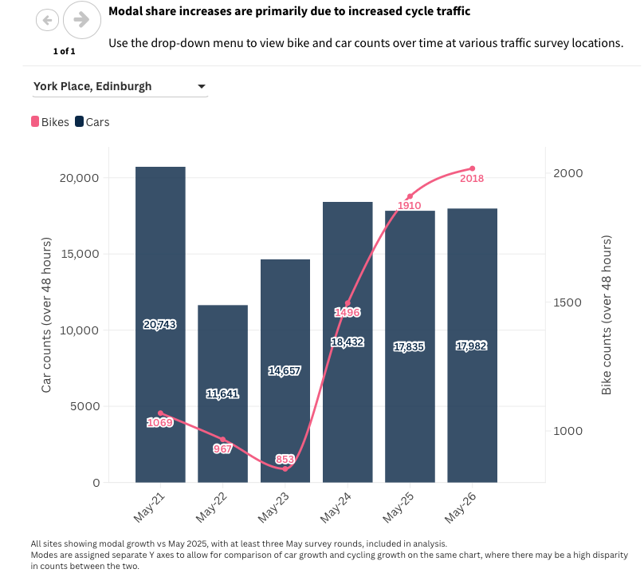

```{r}
#| label: setup
#| include: false

library(tidyverse)
library(plotly)
library(lubridate)
library(here)

# --- Load data -----------------------------------------------------------
# Paths are relative to the project root (themodeshift-scot/), found automatically
# by here() regardless of where this .qmd file lives in the project.
# Expects: themodeshift-scot/data/traffic_counts_inverness.csv
traffic_counts_inverness <- read_csv(here("data", "traffic_counts_inverness.csv"))

# shared plotly styling to match the site's light blue/white theme
plotly_theme <- function(p, y_title = NULL) {
  p %>%
    layout(
      paper_bgcolor = "rgba(0,0,0,0)",
      plot_bgcolor  = "rgba(0,0,0,0)",
      font  = list(color = "#1a1a1a", family = "Helvetica, Arial, sans-serif", size = 12),
      xaxis = list(gridcolor = "#e0e6ea", zeroline = FALSE, title = ""),
      yaxis = list(gridcolor = "#e0e6ea", zeroline = FALSE, title = y_title),
      legend = list(orientation = "h", y = -0.2),
      margin = list(l = 60, r = 20, t = 10, b = 40)
    ) %>%
    config(displaylogo = FALSE)
}

millburn_orange <- "#eb6834"
accent_blue     <- "#2a78d6"
accent_green    <- "#1baf7a"
muted_gray      <- "#6b7278"
```

Last week, Cycling Scotland published a report detailing [the recent increases in cycling counts in Glasgow and Edinburgh](https://cycling.scot/news/scotland-s-bike-lane-networks-break-new-records). As well as being great news for active travel in those cities, the article's authors have done a few things really well in how they've communicated the data. I'm going to highlight some of them here, offer some criticisms and my thoughts on what the data might mean.

Before I start, I want to acknowledge a few things. Firstly, I am most certainly approaching this from a biased position as reading about more people riding bikes is inherently going to put me in a better mood. I also want to make it clear that while this will be a sharp contrast with my [post about a recent Inverness Courier article](https://themodeshift.scot/posts/2026-09-10-courier-20mph-article/), I'm aware that these are articles written by very different organisations with a very different access to time, expertise etc. Still, I think CS have done a great job here and I want to celebrate it.

## Didn't They Do Well?

Here's a bunch of great things that the authors did in their article:

### ✅  Links to the data!

There are a lot of reasons why linking to your data sources is a good idea. As a reader it tells me that the author has enough confidence in their conclusions to be fully scrutinised and are leaving the door open to informed discussion. As a data nerd it means I can see if their methods are reproducible

(put in the graphs here from the raw data)

### ✅ Apples with apples

It's really clear that reasonable comparisons are being made throughout the article. Each headline number is site-specific, with clear descriptions of the time-frames measured and each location only being compared with its own historic data. This level of detail is really important as it narrows the scope of any claims to the data that support it. You can't look at this data and conclude that cycling is on the up all across Scotland but you can see the impact of some key interventions. 

### ✅  Tricky charts done well

Part way down the article we meet some charts comparing the counts of bikes and cars at some locations:

{#fig-york-place-graph fig-alt="Dual-axis bar and line chart titled 'Modal share increases are primarily due to increased cycle traffic,' showing York Place, Edinburgh from May 2021 to May 2026. Bars show car counts (left axis, roughly 20,700 in 2021 dropping to a low of ~14,700 in 2023, then recovering to ~18,000 by 2026). A line shows bike counts (right axis) falling from 1,069 in 2021 to a low of 853 in 2023, then climbing sharply to 2,018 by 2026 — nearly double the 2021 figure, while car counts remain below their 2021 level throughout. Note: bikes and cars are plotted on separate Y axes due to the large disparity in counts between the two modes, so the bars and line are not directly comparable in scale." width="80%" fig-align="center"}

I generally get a sense of dread when I see graphs with dual y axes, and right enough at first glance this chart is easy to misinterpret. The authors are trying to show that car traffic isn't dropping when cycle traffic rises, but the traffic levels are a different order of magnitude in size so putting them on one axis would make the comparison difficult. It takes a bit more attention to see that each point/bar is labeled with its value and a brief descriptor in the caption. It's not a perfect solution but overall it does a good job of making the point while being clear about the compromise that has been made - any data visualisation involves choices and I really appreciate how transparent the authors are being here.


